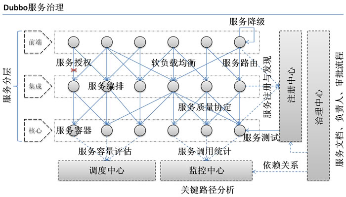

# Dubbo源码解读与实战笔记

## 前言

版本说明

```properties
Dubbo=
Zookeeper=3.6.1
```

相关链接：

* Dubbo 官网：https://dubbo.apache.org/zh-cn/
* Dubbo Github 地址：https://github.com/apache/dubbo
* Zookeeper 官网：https://zookeeper.apache.org
* Dubbo-Admin Github 地址：

## Dubbo 产生与架构

### 背景


1. **单一应用架构：** 当网站流量很小时，只需一个应用，将所有功能都部署在一起，以减少部署节点和成本。此时，用于简化增删改查工作量的数据访问框架(ORM)是关键；
2. **垂直应用架构：** 当访问量逐渐增大，单一应用增加机器带来的加速度越来越小，提升效率的方法之一是将应用拆成互不相干的几个应用，以提升效率。此时，用于加速前端页面开发的Web框架(MVC)是关键；
3. **分布式服务架构：** 当垂直应用越来越多，应用之间交互不可避免，将核心业务抽取出来，作为独立的服务，逐渐形成稳定的服务中心，使前端应用能更快速的响应多变的市场需求。此时，用于提高业务复用及整合的分布式服务框架(RPC)是关键；
4. **流动计算架构：** 当服务越来越多，容量的评估，小服务资源的浪费等问题逐渐显现，此时需增加一个调度中心基于访问压力实时管理集群容量，提高集群利用率。此时，用于提高机器利用率的资源调度和治理中心(SOA)是关键。

### Dubbo最基本的需求



在大规模服务化之前，应用可能只是通过 RMI 或 Hessian 等工具，简单的暴露和引用远程服务，通过配置服务的URL地址进行调用，通过 F5 等硬件进行负载均衡。

**当服务越来越多时，服务 URL 配置管理变得非常困难，F5 硬件负载均衡器的单点压力也越来越大。** 此时需要一个服务注册中心，动态地注册和发现服务，使服务的位置透明。并通过在消费方获取服务提供方地址列表，实现软负载均衡和 Failover，降低对 F5 硬件负载均衡器的依赖，也能减少部分成本。

**当进一步发展，服务间依赖关系变得错踪复杂，甚至分不清哪个应用要在哪个应用之前启动，架构师都不能完整的描述应用的架构关系。** 这时，需要自动画出应用间的依赖关系图，以帮助架构师理清关系。

**接着，服务的调用量越来越大，服务的容量问题就暴露出来，这个服务需要多少机器支撑？什么时候该加机器？** 为了解决这些问题，第一步，要将服务现在每天的调用量，响应时间，都统计出来，作为容量规划的参考指标。其次，要可以动态调整权重，在线上，将某台机器的权重一直加大，并在加大的过程中记录响应时间的变化，直到响应时间到达阈值，记录此时的访问量，再以此访问量乘以机器数反推总容量。

### 架构


**节点角色说明** 

| 节点        | 角色说明                               |
| ----------- | -------------------------------------- |
| `Provider`  | 暴露服务的服务提供方                   |
| `Consumer`  | 调用远程服务的服务消费方               |
| `Registry`  | 服务注册与发现的注册中心               |
| `Monitor`   | 统计服务的调用次数和调用时间的监控中心 |
| `Container` | 服务运行容器                           |

**调用关系说明** 

1. 服务容器负责启动，加载，运行服务提供者。
2. 服务提供者在启动时，向注册中心注册自己提供的服务。
3. 服务消费者在启动时，向注册中心订阅自己所需的服务。
4. 注册中心返回服务提供者地址列表给消费者，如果有变更，注册中心将基于长连接推送变更数据给消费者。
5. 服务消费者，从提供者地址列表中，基于软负载均衡算法，选一台提供者进行调用，如果调用失败，再选另一台调用。
6. 服务消费者和提供者，在内存中累计调用次数和调用时间，定时每分钟发送一次统计数据到监控中心。

## 源码

### 源码编译

执行下面 mvn 命令，如果缺少项目中某个模块依赖，先对该模块运行下面命令

```shell
clean compile package install -Dmaven.test.skip=true
```

### 模块说明

- **dubbo-common 公共逻辑模块**：包括 Util 类和通用模型。
- **dubbo-remoting 远程通讯模块**：相当于 Dubbo 协议的实现，如果 RPC 用 RMI 协议则不需要使用此包。
- **dubbo-rpc 远程调用模块**：抽象各种协议，以及动态代理，只包含一对一的调用，不关心集群的管理。
- **dubbo-cluster 集群模块**：将多个服务提供方伪装为一个提供方，包括：负载均衡, 容错，路由等，集群的地址列表可以是静态配置的，也可以是由注册中心下发。
- **dubbo-registry 注册中心模块**：基于注册中心下发地址的集群方式，以及对各种注册中心的抽象。
- **dubbo-monitor 监控模块**：统计服务调用次数，调用时间的，调用链跟踪的服务。
- **dubbo-config 配置模块**：是 Dubbo 对外的 API，用户通过 Config 使用 Dubbo，隐藏 Dubbo 所有细节。
- **dubbo-container 容器模块**：是一个 Standlone 的容器，以简单的 Main 加载 Spring 启动，因为服务通常不需要 Tomcat/JBoss 等 Web 容器的特性，没必要用 Web 容器去加载服务。

### demo 模块

在 `Dubbo` 源码中我们可以看到一个 `dubbo-demo` 模块，共包括三个非常基础 的 `Dubbo` 示例项目，分别是： 使用 `XML` 配置的 `Demo` 示例、使用注解配置的 `Demo` 示例 以及 直接使用 `API` 的 `Demo` 示例 。下面我们将从这三个示例的角度，简单介绍 `Dubbo` 的基本使用。同时，这三个项目也将作为后续 `Debug Dubbo` 源码的入口，我们会根据需要在其之上进行修改 。


## Dubbo 演练

### 通过接口模块

接口门面

```java
package top.simba1949.facade;

/**
 * @author Anthony
 * @date 2020/7/31 11:55
 */
public interface IDubboService {
    /**
     * sayHello
     * @param name
     * @return
     */
    String sayHello(String name);
}
```

### 基于 XML 配置

***基于 spring-boot 演练，使用 dubbo 配置文件配置***

#### pom 核心依赖

```xml
<!-- https://mvnrepository.com/artifact/org.apache.dubbo/dubbo -->
<dependency>
    <groupId>org.apache.dubbo</groupId>
    <artifactId>dubbo</artifactId>
    <version>2.7.8</version>
</dependency>
<!-- 连接 zookeeper 的客户端-->
<!-- https://mvnrepository.com/artifact/org.apache.curator/curator-recipes -->
<dependency>
    <groupId>org.apache.curator</groupId>
    <artifactId>curator-recipes</artifactId>
    <version>5.1.0</version>
</dependency>
```

#### 生产者

##### **pom**

```xml
<?xml version="1.0" encoding="UTF-8"?>
<project xmlns="http://maven.apache.org/POM/4.0.0"
         xmlns:xsi="http://www.w3.org/2001/XMLSchema-instance"
         xsi:schemaLocation="http://maven.apache.org/POM/4.0.0 http://maven.apache.org/xsd/maven-4.0.0.xsd">
    <modelVersion>4.0.0</modelVersion>

    <groupId>top.simba1949</groupId>
    <artifactId>dubbo-demo-xml-provider</artifactId>
    <version>1.0-SNAPSHOT</version>

    <properties>
        <!--spring-boot 和 spring-cloud 版本兼容参考 https://spring.io/projects/spring-cloud -->
        <!-- https://mvnrepository.com/artifact/org.springframework.boot/spring-boot-dependencies -->
        <spring-boot-dependencies.version>2.2.9.RELEASE</spring-boot-dependencies.version>
        <main.class>top.simba1949.Application</main.class>
    </properties>

    <!-- Inherit defaults from Spring Boot
        参考链接：https://docs.spring.io/spring-boot/docs/2.3.2.RELEASE/maven-plugin/reference/html/#using

        Maven用户可以从spring-boot-starter-parent项目继承以获得合理的默认值。父项目提供以下功能：
        1.Java 1.8是默认的编译器级别。
        2.UTF-8源编码。
        3.从spring-boot-dependenciesPOM 继承的依赖性管理部分，用于管理常见依赖性的版本。
        4.具有执行ID 的repackage目标的repackage执行。
     -->
    <parent>
        <groupId>org.springframework.boot</groupId>
        <artifactId>spring-boot-starter-parent</artifactId>
        <version>2.2.9.RELEASE</version>
    </parent>

    <dependencies>
        <!--声明是web项目，防止启动后自动关闭项目-->
        <dependency>
            <groupId>org.springframework.boot</groupId>
            <artifactId>spring-boot-starter-web</artifactId>
        </dependency>

        <dependency>
            <groupId>top.simba1949</groupId>
            <artifactId>dubbo-demo-interface</artifactId>
            <version>1.0-SNAPSHOT</version>
        </dependency>

        <!-- https://mvnrepository.com/artifact/org.apache.dubbo/dubbo -->
        <dependency>
            <groupId>org.apache.dubbo</groupId>
            <artifactId>dubbo</artifactId>
            <version>2.7.8</version>
        </dependency>
        <!-- 连接 zookeeper 的客户端-->
        <!-- https://mvnrepository.com/artifact/org.apache.curator/curator-recipes -->
        <dependency>
            <groupId>org.apache.curator</groupId>
            <artifactId>curator-recipes</artifactId>
            <version>5.1.0</version>
        </dependency>
    </dependencies>

    <build>
        <plugins>
            <plugin>
                <groupId>org.springframework.boot</groupId>
                <artifactId>spring-boot-maven-plugin</artifactId>
            </plugin>
        </plugins>

        <!--IDEA是不会编译src的java目录的文件，如果需要读取，则需要手动指定哪些配置文件需要读取-->
        <resources>
            <resource>
                <directory>src/main/java</directory>
                <includes>
                    <include>**/*.xml</include>
                </includes>
            </resource>
            <resource>
                <directory>src/main/resources</directory>
                <includes>
                    <include>**/*</include>
                </includes>
            </resource>
        </resources>
    </build>
</project>
```

##### **配置**

**application.yml 配置**

```yaml
server:
  port: 9000
spring:
  application:
    name: dubbo-demo-xml-provider
```

**dubbo-xml-provider.xml 配置**

```xml
<?xml version="1.0" encoding="UTF-8"?>
<beans xmlns="http://www.springframework.org/schema/beans"
       xmlns:xsi="http://www.w3.org/2001/XMLSchema-instance"
       xmlns:dubbo="http://dubbo.apache.org/schema/dubbo"
       xsi:schemaLocation="http://www.springframework.org/schema/beans http://www.springframework.org/schema/beans/spring-beans-4.3.xsd
       http://dubbo.apache.org/schema/dubbo http://dubbo.apache.org/schema/dubbo/dubbo.xsd">

    <!--当前应用名称，用于注册中心计算应用间依赖关系-->
    <dubbo:application name="dubbo-demo-xml-provider" id="id-dubbo-demo-xml-provider"/>
    <!--注册中心配置-->
    <dubbo:registry address="zookeeper://127.0.0.1:2181" />
    <!--<dubbo:registry protocol="redis" address="127.0.0.1:6379" />-->
    <!--服务提供者协议配置,
        端口配置：dubbo协议缺省端口为20880，rmi协议缺省端口为1099，http和hessian协议缺省端口为80；
        如果没有配置port，则自动采用默认端口，如果配置为-1，则会分配一个没有被占用的端口。-->
    <dubbo:protocol name="dubbo" port="20880"/>

    <!-- 配置为 Spring Bean -->
    <bean id="dubboService" class="top.simba1949.service.impl.DubboServiceImpl"></bean>

    <dubbo:service interface="top.simba1949.facade.IDubboService" ref="dubboService"/>
</beans>
```

##### 导入 dubbo 配置的配置类

```java
package top.simba1949.config;

import org.springframework.context.annotation.Configuration;
import org.springframework.context.annotation.ImportResource;

/**
 * @author Anthony
 * @date 2020/7/31 12:00
 */
@Configuration
@ImportResource(locations = "classpath:/dubbo/dubbo-xml-provider.xml")
public class DubboConfig {
}
```

##### 接口实现类

```java
package top.simba1949.service.impl;

import top.simba1949.facade.IDubboService;

/**
 * @author Anthony
 * @date 2020/7/31 11:59
 */
public class DubboServiceImpl implements IDubboService {

    @Override
    public String sayHello(String name) {
        System.out.println("receive parameter {name} is " + name);
        return "Hello, " + name;
    }
}
```

##### 启动类

```java
package top.simba1949;

import org.springframework.boot.SpringApplication;
import org.springframework.boot.autoconfigure.SpringBootApplication;

/**
 * @author Anthony
 * @date 2020/7/31 11:56
 */
@SpringBootApplication
public class Application {
    public static void main(String[] args) {
        SpringApplication.run(Application.class, args);
    }
}
```

#### 消费者

##### pom

```xml
<?xml version="1.0" encoding="UTF-8"?>
<project xmlns="http://maven.apache.org/POM/4.0.0"
         xmlns:xsi="http://www.w3.org/2001/XMLSchema-instance"
         xsi:schemaLocation="http://maven.apache.org/POM/4.0.0 http://maven.apache.org/xsd/maven-4.0.0.xsd">
    <modelVersion>4.0.0</modelVersion>

    <groupId>top.simba1949</groupId>
    <artifactId>dubbo-demo-xml-consumer</artifactId>
    <version>1.0-SNAPSHOT</version>

    <!-- Inherit defaults from Spring Boot -->
    <parent>
        <groupId>org.springframework.boot</groupId>
        <artifactId>spring-boot-starter-parent</artifactId>
        <version>2.2.9.RELEASE</version>
    </parent>

    <dependencies>
        <dependency>
            <groupId>org.springframework.boot</groupId>
            <artifactId>spring-boot-starter-web</artifactId>
        </dependency>
        <dependency>
            <groupId>top.simba1949</groupId>
            <artifactId>dubbo-demo-interface</artifactId>
            <version>1.0-SNAPSHOT</version>
        </dependency>
        <!-- https://mvnrepository.com/artifact/org.apache.dubbo/dubbo -->
        <dependency>
            <groupId>org.apache.dubbo</groupId>
            <artifactId>dubbo</artifactId>
            <version>2.7.8</version>
        </dependency>
        <!-- 连接 zookeeper 的客户端-->
        <!-- https://mvnrepository.com/artifact/org.apache.curator/curator-recipes -->
        <dependency>
            <groupId>org.apache.curator</groupId>
            <artifactId>curator-recipes</artifactId>
            <version>5.1.0</version>
        </dependency>
    </dependencies>

    <build>
        <plugins>
            <plugin>
                <groupId>org.springframework.boot</groupId>
                <artifactId>spring-boot-maven-plugin</artifactId>
            </plugin>
        </plugins>
    </build>
</project>
```

##### 配置

application.yml

```yaml
server:
  port: 8000
spring:
  application:
    name: dubbo-demo-xml-consumer
```

dubbo-xml-provider.xml

```xml
<?xml version="1.0" encoding="UTF-8"?>
<beans xmlns="http://www.springframework.org/schema/beans"
       xmlns:xsi="http://www.w3.org/2001/XMLSchema-instance"
       xmlns:dubbo="http://dubbo.apache.org/schema/dubbo"
       xsi:schemaLocation="http://www.springframework.org/schema/beans http://www.springframework.org/schema/beans/spring-beans-4.3.xsd http://dubbo.apache.org/schema/dubbo http://dubbo.apache.org/schema/dubbo/dubbo.xsd">

    <dubbo:application id="id-dubbo-demo-xml-consumer" name="dubbo-demo-xml-consumer"/>
    <!--<dubbo:registry protocol="redis" address="127.0.0.1:6379" />-->
    <dubbo:registry address="zookeeper://127.0.0.1:2181"/>
    <dubbo:protocol name="dubbo" port="20880"/>

    <dubbo:reference id="dubboService"
                     interface="top.simba1949.facade.IDubboService"
                     timeout="6000" check="false"/>
</beans>
```

##### 导入 dubbo 配置的配置类

```java
package top.simba1949.config;

import org.springframework.context.annotation.Configuration;
import org.springframework.context.annotation.ImportResource;

/**
 * @author Anthony
 * @date 2020/7/31 12:05
 */
@Configuration
@ImportResource(locations = "classpath:/dubbo/dubbo-xml-consumer.xml")
public class DubboConfig {
}
```

##### 调用者 controller

```java
package top.simba1949.controller;

import org.springframework.beans.factory.annotation.Autowired;
import org.springframework.web.bind.annotation.GetMapping;
import org.springframework.web.bind.annotation.RequestMapping;
import org.springframework.web.bind.annotation.RestController;
import top.simba1949.facade.IDubboService;

/**
 * @author Anthony
 * @date 2020/7/31 12:05
 */
@RestController
@RequestMapping("dubbo")
public class DubboController {
    /**
     * 在 dubbo-xml-consumer.xml 中配置 
     * <dubbo:reference id="dubboService" interface="top.simba1949.facade.IDubboService" timeout="6000" check="false"/>
     * 会自动将 IDubboService 注册到 spring 容器中，直接直接注入
     */
    @Autowired
    private IDubboService dubboService;

    @GetMapping
    public String sayHello(String name){
        System.out.println("the parameter {name} is " + name);
        String result = dubboService.sayHello(name);
        System.out.println("the response result is " + result);
        return result;
    }
}
```

##### 启动类

```java
package top.simba1949;

import org.springframework.boot.SpringApplication;
import org.springframework.boot.autoconfigure.SpringBootApplication;

/**
 * @author Anthony
 * @date 2020/7/31 12:04
 */
@SpringBootApplication
public class Application {
    public static void main(String[] args) {
        SpringApplication.run(Application.class, args);
    }
}
```

### 基于注解配置

***基于 spring-boot 演练，使用 dubbo-spring-boot-starter 配置文件配置***

#### pom 核心依赖

```xml
<!-- https://mvnrepository.com/artifact/org.apache.dubbo/dubbo-spring-boot-starter -->
<dependency>
    <groupId>org.apache.dubbo</groupId>
    <artifactId>dubbo-spring-boot-starter</artifactId>
    <version>2.7.7</version>
</dependency>
<!-- zookeeper 客户端 -->
<!-- https://mvnrepository.com/artifact/org.apache.dubbo/dubbo-dependencies-zookeeper -->
<dependency>
    <groupId>org.apache.dubbo</groupId>
    <artifactId>dubbo-dependencies-zookeeper</artifactId>
    <version>2.7.8</version>
    <type>pom</type>
</dependency>
```

####  生产者

##### pom

```xml
<?xml version="1.0" encoding="UTF-8"?>
<project xmlns="http://maven.apache.org/POM/4.0.0"
         xmlns:xsi="http://www.w3.org/2001/XMLSchema-instance"
         xsi:schemaLocation="http://maven.apache.org/POM/4.0.0 http://maven.apache.org/xsd/maven-4.0.0.xsd">
    <modelVersion>4.0.0</modelVersion>

    <groupId>top.simba1949</groupId>
    <artifactId>dubbo-demo-annotation-provider</artifactId>
    <version>1.0-SNAPSHOT</version>

    <properties>
        <!--spring-boot 和 spring-cloud 版本兼容参考 https://spring.io/projects/spring-cloud -->
        <main.class>top.simba1949.Application</main.class>
    </properties>

    <!-- Inherit defaults from Spring Boot
        参考链接：https://docs.spring.io/spring-boot/docs/2.3.2.RELEASE/maven-plugin/reference/html/#using

        Maven用户可以从spring-boot-starter-parent项目继承以获得合理的默认值。父项目提供以下功能：
        1.Java 1.8是默认的编译器级别。
        2.UTF-8源编码。
        3.从spring-boot-dependenciesPOM 继承的依赖性管理部分，用于管理常见依赖性的版本。
        4.具有执行ID 的repackage目标的repackage执行。
     -->
    <parent>
        <groupId>org.springframework.boot</groupId>
        <artifactId>spring-boot-starter-parent</artifactId>
        <version>2.2.9.RELEASE</version>
    </parent>

    <dependencies>
        <!--声明是web项目，防止启动后自动关闭项目-->
        <dependency>
            <groupId>org.springframework.boot</groupId>
            <artifactId>spring-boot-starter-web</artifactId>
        </dependency>

        <dependency>
            <groupId>top.simba1949</groupId>
            <artifactId>dubbo-demo-interface</artifactId>
            <version>1.0-SNAPSHOT</version>
        </dependency>

        <!-- https://mvnrepository.com/artifact/org.apache.dubbo/dubbo-spring-boot-starter -->
        <dependency>
            <groupId>org.apache.dubbo</groupId>
            <artifactId>dubbo-spring-boot-starter</artifactId>
            <version>2.7.7</version>
        </dependency>
        <!-- zookeeper 客户端 -->
        <!-- https://mvnrepository.com/artifact/org.apache.dubbo/dubbo-dependencies-zookeeper -->
        <dependency>
            <groupId>org.apache.dubbo</groupId>
            <artifactId>dubbo-dependencies-zookeeper</artifactId>
            <version>2.7.8</version>
            <type>pom</type>
        </dependency>
    </dependencies>

    <build>
        <plugins>
            <plugin>
                <groupId>org.springframework.boot</groupId>
                <artifactId>spring-boot-maven-plugin</artifactId>
            </plugin>
        </plugins>

        <!--IDEA是不会编译src的java目录的文件，如果需要读取，则需要手动指定哪些配置文件需要读取-->
        <resources>
            <resource>
                <directory>src/main/java</directory>
                <includes>
                    <include>**/*.xml</include>
                </includes>
            </resource>
            <resource>
                <directory>src/main/resources</directory>
                <includes>
                    <include>**/*</include>
                </includes>
            </resource>
        </resources>
    </build>
</project>
```

##### 配置

```yaml
server:
  port: 9000
spring:
  application:
    name: dubbo-demo-annotation-provider
# dubbo 相关配置
dubbo:
  application:
    name: ${spring.application.name}
  # 注册中心
  registry:
    address: zookeeper://localhost
    port: 2181
  protocol:
    name: dubbo
    port: 20880
  scan:
    # 扫描dubbo注解，多个值使用英文逗号隔开
    base-packages: top.simba1949.service.impl
```

##### 接口实现类

```java
package top.simba1949.service.impl;

import org.apache.dubbo.config.annotation.DubboService;
import top.simba1949.facade.IDubboService;

/**
 * @author Anthony
 * @date 2020/7/31 16:11
 */
@DubboService()
public class DubboServiceImpl implements IDubboService {
    @Override
    public String sayHello(String name) {
        System.out.println("receive parameter {name} is " + name);
        return "Hello, " + name;
    }
}
```

##### 启动类

```java
package top.simba1949;

import org.springframework.boot.SpringApplication;
import org.springframework.boot.autoconfigure.SpringBootApplication;

/**
 * @author Anthony
 * @date 2020/7/31 16:01
 */
@SpringBootApplication
public class Application {
    public static void main(String[] args) {
        SpringApplication.run(Application.class, args);
    }
}
```

#### 消费者

##### pom

```xml
<?xml version="1.0" encoding="UTF-8"?>
<project xmlns="http://maven.apache.org/POM/4.0.0"
         xmlns:xsi="http://www.w3.org/2001/XMLSchema-instance"
         xsi:schemaLocation="http://maven.apache.org/POM/4.0.0 http://maven.apache.org/xsd/maven-4.0.0.xsd">
    <modelVersion>4.0.0</modelVersion>

    <groupId>top.simba1949</groupId>
    <artifactId>dubbo-demo-annotation-consumer</artifactId>
    <version>1.0-SNAPSHOT</version>

    <properties>
        <!--spring-boot 和 spring-cloud 版本兼容参考 https://spring.io/projects/spring-cloud -->
        <main.class>top.simba1949.Application</main.class>
    </properties>

    <!-- Inherit defaults from Spring Boot
        参考链接：https://docs.spring.io/spring-boot/docs/2.3.2.RELEASE/maven-plugin/reference/html/#using

        Maven用户可以从spring-boot-starter-parent项目继承以获得合理的默认值。父项目提供以下功能：
        1.Java 1.8是默认的编译器级别。
        2.UTF-8源编码。
        3.从spring-boot-dependenciesPOM 继承的依赖性管理部分，用于管理常见依赖性的版本。
        4.具有执行ID 的repackage目标的repackage执行。
     -->
    <parent>
        <groupId>org.springframework.boot</groupId>
        <artifactId>spring-boot-starter-parent</artifactId>
        <version>2.2.9.RELEASE</version>
    </parent>

    <dependencies>
        <!--声明是web项目，防止启动后自动关闭项目-->
        <dependency>
            <groupId>org.springframework.boot</groupId>
            <artifactId>spring-boot-starter-web</artifactId>
        </dependency>

        <dependency>
            <groupId>top.simba1949</groupId>
            <artifactId>dubbo-demo-interface</artifactId>
            <version>1.0-SNAPSHOT</version>
        </dependency>

        <!-- https://mvnrepository.com/artifact/org.apache.dubbo/dubbo-spring-boot-starter -->
        <dependency>
            <groupId>org.apache.dubbo</groupId>
            <artifactId>dubbo-spring-boot-starter</artifactId>
            <version>2.7.7</version>
        </dependency>
        <!-- zookeeper 客户端 -->
        <!-- https://mvnrepository.com/artifact/org.apache.dubbo/dubbo-dependencies-zookeeper -->
        <dependency>
            <groupId>org.apache.dubbo</groupId>
            <artifactId>dubbo-dependencies-zookeeper</artifactId>
            <version>2.7.8</version>
            <type>pom</type>
        </dependency>
    </dependencies>

    <build>
        <plugins>
            <plugin>
                <groupId>org.springframework.boot</groupId>
                <artifactId>spring-boot-maven-plugin</artifactId>
            </plugin>
        </plugins>

        <!--IDEA是不会编译src的java目录的文件，如果需要读取，则需要手动指定哪些配置文件需要读取-->
        <resources>
            <resource>
                <directory>src/main/java</directory>
                <includes>
                    <include>**/*.xml</include>
                </includes>
            </resource>
            <resource>
                <directory>src/main/resources</directory>
                <includes>
                    <include>**/*</include>
                </includes>
            </resource>
        </resources>
    </build>
</project>
```

##### 配置

```yaml
server:
  port: 8000
spring:
  application:
    name: dubbo-demo-annotation-consumer
# dubbo 相关配置
dubbo:
  application:
    name: ${spring.application.name}
  registry:
    address: zookeeper://localhost
    port: 2181
  protocol:
    name: dubbo
    port: 20880
  scan:
    base-packages: top.simba1949.controller
```

调用者 controller

```java
package top.simba1949.controller;

import org.apache.dubbo.config.annotation.DubboReference;
import org.springframework.web.bind.annotation.GetMapping;
import org.springframework.web.bind.annotation.RequestMapping;
import org.springframework.web.bind.annotation.RestController;
import top.simba1949.facade.IDubboService;

/**
 * @author Anthony
 * @date 2020/7/31 16:17
 */
@RestController
@RequestMapping("dubbo")
public class DubboController {

    @DubboReference
    private IDubboService dubboService;

    @GetMapping
    public String sayHello(String name){
        System.out.println("the parameter {name} is " + name);
        String result = dubboService.sayHello(name);
        System.out.println("the response result is " + result);
        return result;
    }
}
```

##### 启动类

```java
package top.simba1949;

import org.springframework.boot.SpringApplication;
import org.springframework.boot.autoconfigure.SpringBootApplication;

/**
 * @author Anthony
 * @date 2020/7/31 16:16
 */
@SpringBootApplication
public class Application {
    public static void main(String[] args) {
        SpringApplication.run(Application.class, args);
    }
}
```

### 基于 API 配置


